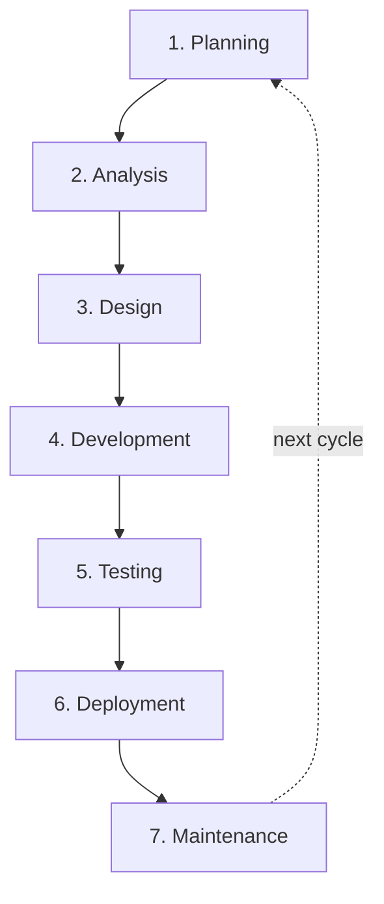

What is the SDLC, and where do AI coding agents actually belong inside it? I keep coming back to this question because, in my experience, most teams start with the wrong frame. They ask "how do I speed up development with agents?" when the more useful question is "which phases of the lifecycle are even a good fit for agent involvement?"

This is the field guide I wish I had when I started integrating agents into real delivery workflows. It covers what the SDLC actually is, how agile changes the rhythm, and where agents fit cleanly versus where they tend to create more noise than signal.

<!-- truncate -->

## What the SDLC is

The software development lifecycle is a structured way to plan, build, release, and maintain software. Its value is not in enforcing a single process, but in giving teams a repeatable frame for turning an idea into a working system while managing scope, quality, cost, risk, and communication.

In practice, the SDLC breaks software work into phases with clear goals and handoffs. Different methodologies arrange those phases differently, some treat them as mostly sequential, others run them in short loops, but the underlying concerns are usually the same.

Without that structure, projects tend to drift. Requirements become fuzzy, testing happens too late, and teams discover important constraints only after significant work has already been done.

## The seven phases

### 1. Planning

Planning sets the direction. The team defines the problem, the intended users, the business goal, and the boundaries of the project.

Typical questions: What problem are we solving? Who will use it? What outcomes matter most? What is explicitly out of scope?

This phase produces an initial requirements or project brief that captures goals, constraints, and a rough timeline.

### 2. Analysis

Analysis turns a high-level idea into a concrete understanding of what the software must do. The team gathers functional requirements, technical constraints, compliance needs, and feasibility signals.

The main outcome is a clearer view of scope and a shared understanding of the work to be implemented. Analysis is also where "can we build this?" gradually gives way to "here is exactly what we are building."

### 3. Design

Design answers: how should this system be built? This covers architecture, data structures, interfaces, workflows, security considerations, and system boundaries.

A design phase may include application architecture, UI flows, database design, integration points with other systems, security design and threat modeling, and service boundaries.

Teams often build early prototypes here to test assumptions before full implementation begins.

### 4. Development

Development is where the software is actually built. Engineers use the outputs of planning, analysis, and design to implement features, APIs, interfaces, and supporting tooling.

Modern teams increasingly use AI tools during development for prototyping, code generation, and debugging support. Those outputs still require review and validation. The phase does not change, but the tooling does.

### 5. Testing

Testing verifies that the system behaves as intended and meets both user needs and technical expectations. It also surfaces security and performance issues before release.

Testing is often iterative: test, fix, test again. It is not a gate at the end, it is a continuous activity that informs development.

### 6. Deployment

Deployment moves the software into an environment where users can access it. A release is not just a technical event; it also includes operational readiness and user enablement.

That can involve staged rollouts, beta releases, training and documentation, release coordination, and monitoring initial production behavior.

### 7. Maintenance

Maintenance continues after release. Software needs fixes, updates, performance improvements, security patches, and support for new use cases as the environment changes.

In modern delivery models, maintenance is not an afterthought. It is part of the normal operating rhythm of the product.

## Agile changes the rhythm, not the concerns

The SDLC is a framework, not a single operating model. Agile is one way to run that framework. Instead of moving through the seven phases once in a linear sequence, agile revisits them in short, repeatable loops.

That shift changes the rhythm:
- Planning happens at multiple levels, from roadmap work to short iteration planning
- Analysis and design continue throughout delivery instead of ending before coding starts
- Testing happens continuously rather than being reserved for the end
- Deployment becomes incremental, with smaller releases and faster feedback
- Maintenance work flows back into the backlog instead of living in a separate lane

Agile is especially useful when requirements are likely to change, when stakeholder feedback is available during delivery, and when teams want to reduce the risk of building the wrong thing for too long.

### Lean inside agile

Lean fits naturally alongside agile because both emphasize learning quickly, improving flow, and reducing work that does not create value.

In practice, lean thinking inside an agile system usually means:
- Keeping work in small batches so teams can learn faster
- Reducing waiting time, handoffs, and partially finished work
- Building quality into the process instead of depending on late inspection
- Using real feedback to guide decisions instead of over-planning far ahead

Lean is a useful counterweight to ceremony-heavy agile. It keeps asking whether a process step is actually helping the team deliver value, or whether it only creates motion without progress.

### Scrum

Scrum is a structured agile framework built around time-boxed sprints: select a small, high-priority slice of work, complete it within a fixed period, inspect the result, adapt based on what was learned.

Scrum works best when a team benefits from a strong cadence, explicit commitments, and regular checkpoints for inspection and adaptation.

Scrum can fail when teams mistake the framework for the outcome. Running the ceremonies is not the same as delivering a usable increment.

### Kanban

Kanban favors continuous flow over time-boxed sprints. Work is visualized on a board, moves across defined stages, and is constrained by work-in-progress limits so bottlenecks become visible early.

Kanban is often a good fit when work arrives continuously, priorities change often, or the team handles a mix of planned features, maintenance, support, and operational tasks.

## Where agents fit

Honestly, this is the part I have spent the most time thinking through, because the instinct is to use agents everywhere. I think the more useful framing is: agents fit cleanly where the phase has a well-defined input and a well-defined output, and they tend to create problems where the phase is inherently about human judgment and negotiation.

### Agents fit well in:

**Analysis and spec writing.** Given a rough brief, a **Specifier** agent can produce a structured spec with a user story, acceptance criteria, and an explicit scope boundary. It is fast, consistent, and catches the "what about X?" gaps before implementation starts. I use this daily!

**Design input.** An **Architect** agent can evaluate multiple design approaches, surface trade-offs, and flag security or scalability concerns. It does not replace the design decision, it feeds it.

**Development.** This is the phase most people start with, and I understand why. A **Builder** agent works well for scoped, well-specified tasks. The sharper the spec, the better the output. In my experience the approach that works is: spec first, then agent. A vague request plus "build this" tends to produce vague results.

**Code review.** A **Verifier** agent doing a first-pass review catches a class of issues, missed edge cases, inconsistent error handling, obvious regressions, that free up human review time for the harder, context-dependent questions.

**Documentation.** A **Documenter** agent that runs alongside development keeps READMEs, changelogs, and API docs current without waiting for someone to remember at the end.

### Agents fit poorly in:

**Planning.** Planning is about aligning people around a goal. It involves negotiation, political context, stakeholder management, and decisions that require understanding organizational constraints that no agent has access to. An agent can help structure a planning document, but I believe it should not be the one making the call.

**Stakeholder communication.** Any communication that carries accountability, to a team, to a customer, to a leadership group, needs a human to stand behind it. Agents can produce a useful draft, but ownership has to stay with a person.

**Deployment decisions.** The decision to release to production involves risk tolerance that depends on context an agent cannot fully see: the current load, the team's confidence, the customer segment affected, the business calendar. Use agents to prepare the release plan; keep the human in the loop for the go/no-go.

## The pattern that works

From practical experience with agentic workflows, the structure I tend to rely on is:

1. **Spec first.** Before a **Builder** writes a line, there is a spec, even a short one. The **Specifier** agent produces it; a human reviews and approves it.
2. **Agents for implementation.** The **Builder** works against the approved spec. The scope is tight, the expectations are explicit.
3. **Independent review.** The **Verifier** runs in a separate context with no attachment to the implementation choices. Independence is the property that makes review useful.
4. **Human in the loop for releases.** The **Deployer** prepares the plan; a human confirms the go.
5. **Documentation alongside, not after.** The **Documenter** runs continuously rather than being left for the end.

The failure mode to avoid is using agents to accelerate past the phases that exist to catch mistakes. Speed is only useful when the surrounding workflow still protects clarity, focus, review quality, and learning.

## Conclusion

The SDLC is not a relic of waterfall. It is the map of concerns that every software project has to address, regardless of methodology. Agile changes how those concerns are managed, not whether they exist.

AI coding agents fit into that map at specific points, most cleanly where inputs and outputs are well-defined and the work is producing an artifact rather than making a human judgment call. The teams I have seen get the most from agents are not the ones who gave agents the most freedom. Personally, I think they are the ones who were most deliberate about which phase the agent was operating in and what the scope of that phase was.

I am still refining this myself... there are phases where I keep experimenting with agent involvement, and the picture is not fully settled for me yet. But the underlying structure of the SDLC has turned out to be a surprisingly solid guide for figuring out where to try next. I hope it is useful for you too. :-)
