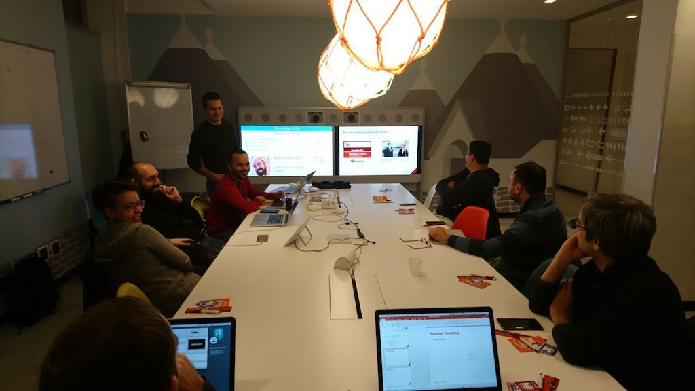

# Da REST a GraphQL in 90 minuti

_21 Dicembre 2017, Hotels.com Technology Rome Office_

Il team HCOM technology di Roma vorrebbe condividere con voi le esperienze fatte con GraphQL, e discutere su come questo linguaggio possa essere favorito rispetto all'ormai consueto paradigma REST.

Durante l'incontro faremo una introduzione ai principi base di GraphQL, parleremo di come si definisce uno schema per descrivere i dati e di come è poi possibile eseguire delle interrogazioni su di esso. Subito dopo seguirà una parte pratica durante la quale implementeremo un servizio GraphQL utilizzando l'implementazione javascript.

<!-- truncate -->

## Cosa è GraphQL?

GraphQL è una specifica di query language che consente di descrivere la struttura dei dati nelle applicazioni moderne attraverso uno schema ben definito. Essendo una specifica, puoi utilizzare GraphQL con qualsiasi linguaggio di programmazione e, ad oggi, già sono presenti molteplici implementazioni.
Anche se inizialmente può sembrare complicato, GraphQL semplifica la creazione, l'evoluzione, e la documentazione delle API a tal punto da essere preferito al classico approccio REST.
Facebook ha inizialmente ideato il linguaggio GraphQL nel 2012 per utilizzarlo con le applicazioni mobile, e solo nel 2015 ha rilasciato la specifica in open source. Da quel momento GraphQL è stato adottato da molteplici realtà, inclusa la nostra, con ottimi risultati.

## Chi può partecipare?

Anche se si prevede una sessione pratica focalizzata sulla parte di back-end, l'incontro sarà di carattere introduttivo. È consigliato a tutti coloro che sono interessati a questa tecnologia o che già stanno programmando di adottare GraphQL!

## Dove si terrà l'incontro?

HCOM Tech Rome è lieta di invitarvi nella sede di HOTELS.COM che gentilmente ci ospiterà offrendoci un gradito rinfresco a fine presentazione.

La Registrazione è OBBLIGATORIA per garantirvi l'accesso allo stabile e per consentirci di organizzare il tutto in maniera adeguata.

[📄 source code](https://github.com/fsferrara/from-rest-to-graphql-meetup)
[💾 slides](/downloads/talks/da-rest-a-graphql-in-90-minuti.pdf)
[🔗 meetup page](https://www.meetup.com/Rome-Software-Discussion/events/245282496/?eventId=245282496)
