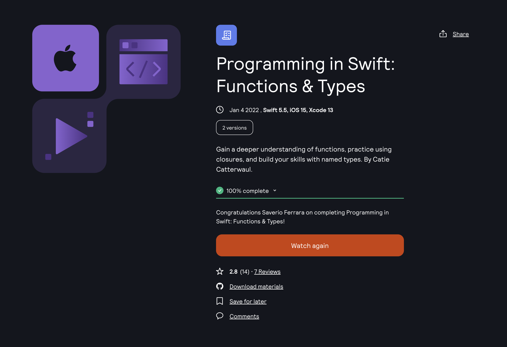

Learning Platform: [Kodeko](https://www.kodeco.com/)
Course: [Programming in Swift: Functions & Types](https://www.kodeco.com/28433240-programming-in-swift-functions-types)

<!-- truncate -->

## Learning path

This is part of the **iOS and SwiftUI for Beginners** learning path. [View path](https://www.kodeco.com/ios/paths/learn).

## Who is this for?

This is the fourth course in our _iOS and Swift for Beginners learning path_. You’re ready for this course if you’re working through that learning path in order, or you’re someone who has just a little bit of Swift experience.

To start, you’ll review some function fundamentals and learn more advanced features of functions. You’ll also practice writing closures, a close relative of functions, and using them to manipulate collections.

Then, you’ll move on to build your skills in writing named types: structures, classes, enumerations, and protocols. You’ll learn about the features they share, and some of the functionality that makes each unique.

Throughout the course, you’ll practice everything you learn with hands-on challenges.

This course isn’t suited for advanced developers. If that’s you, check out our _Advanced Swift Courses_ for more ways to level-up your Swift skills!

## Covered concepts

- Functions
- Overloading
- Closures
- Higher-Order Functions
- Enumerations
- Switch Statements
- Getters and Setters
- Property Observers
- Computed Properties
- Lazy Variables
- Methods
- Subclassing
- Initializers
- Protocols
- Extensions

