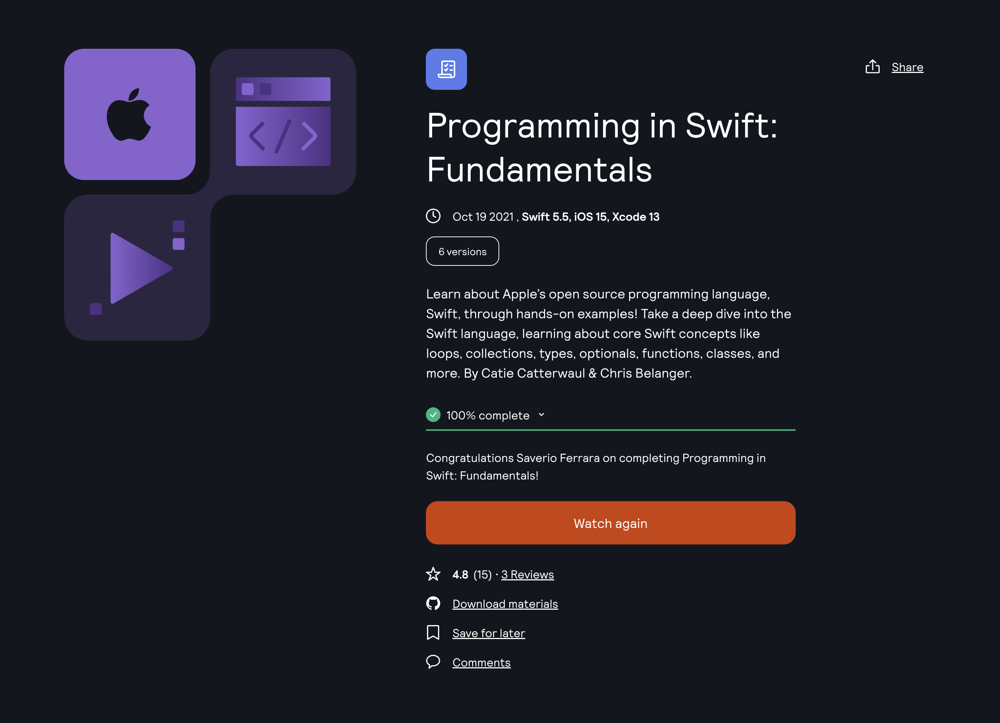

Learning Platform: [Kodeko](https://www.kodeco.com/)
Course: [Programming in Swift: Fundamentals](https://www.kodeco.com/28092971-programming-in-swift-fundamentals)

<!-- truncate -->

## Learning path

This is part of the **iOS and SwiftUI for Beginners** learning path. [View path](https://www.kodeco.com/ios/paths/learn).

## Who is this for?

Beginners! If you’ve never created a playground before, or if you aren’t sure what while loops or break statements are, this is a great course to get you started. With easy-to-understand lessons and hands-on practice, soon you’ll be writing your own methods and implementing structures and classes with ease.

You’ll start at the very beginning, creating your first playground and learning about comments, tuples, booleans, and operators. Then, you’ll learn to control the flow of your code. For loops, switch statements, enums, oh my! You’ll build on the basics by implementing functionals and optionals through fun, hands-on challenges.

This course isn’t suited for intermediate or advanced developers. If that’s you, check out our intermediate or advanced video courses for more ways to level-up your developer skills!

## Covered concepts

- Playgrounds
- Comments
- Tuples
- Booleans
- Operators
- For loops
- While loops
- Switch statements
- Enumerations
- Functionals
- Optionals
- Collections
- Arrays
- Dictionaries
- Structures
- Properties
- Methods
- Classes/Subclasses
- Protocols
- Closures
- Initializers
- Memory management
