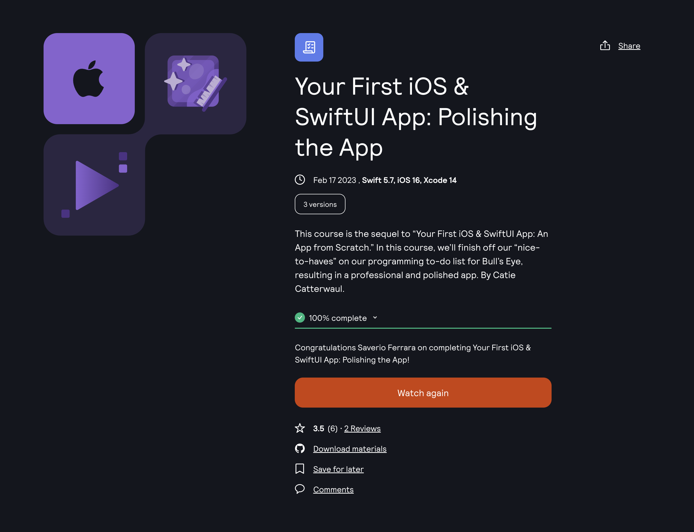

Learning Platform: [Kodeko](https://www.kodeco.com/)
Course: [Your First iOS & SwiftUI App: Polishing the App](https://www.kodeco.com/38052670-your-first-ios-swiftui-app-polishing-the-app)

<!-- truncate -->

## Learning path

This is part of the **iOS and SwiftUI for Beginners** learning path. [View path](https://www.kodeco.com/ios/paths/learn).

## Who is this for?

This course is for students who have completed “Your First iOS and SwiftUI App: An App from Scratch”, where we developed the “must haves” on our programming to-do list for a simple iOS game called Bull’s Eye.

In this course, we’ll finish off our “nice-to-haves” on our programming to-do list, resulting in a professional and polished app.

Not only will the app look much better, but the code will be much cleaner and well organized too. You’ll learn how to extract your SwiftUI views in order to keep your code clean, reusable, and maintainable, and you’ll continue to use test-driven development to build out and expand your app’s data model.

You’ll also learn about tons of handy techniques that you’ll be using all the time as a professional iOS Developer, including how to use SFSymbols, SwiftUI Animation, Size Classes, and so much more.

By the end of this course, not only will you have created your first app, but you’ll have created a _polished_ app that can carry around in your pocket, an show of to your family and friends.

This course isn’t suited for intermediate or advanced developers. If that’s you, check out our intermediate or advanced video courses for more ways to level up your developer skills.

## Covered concepts

- More SwiftUI View Modifiers
- Colors and Gradients
- Supporting Dark Mode
- Extracting SwiftUI Views
- Filling and Stroking Shapes
- SFSymbols
- The Xcode Debugger
- The Environment Property Wrapper
- Xcode Shortcuts
- Size Classes
- Swift Arrays
- App Icon & Display Name
- Running on Your Own Device

