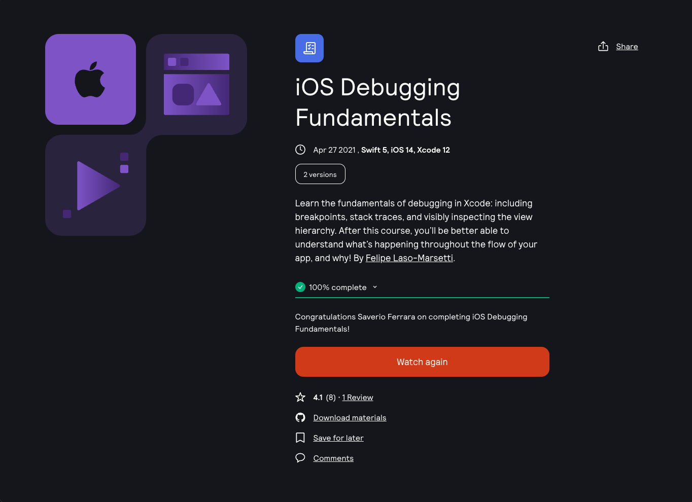

Learning Platform: [Kodeko](https://www.kodeco.com/)
Course: [iOS Debugging Fundamentals](https://www.kodeco.com/18770184-ios-debugging-fundamentals)

<!-- truncate -->

## Learning path

This is part of the **iOS IDEs & Tools** learning path. [View path](https://www.kodeco.com/ios/paths/iostools).

## Who is this for?

This course is for beginner developers coming from our previous iOS paths ([iOS and SwiftUI for Beginners](https://www.raywenderlich.com/ios/paths/learn?__hstc=149040233.9baeb4decfaebfda9df12ab928a4b884.1713419175924.1727591180177.1727816598645.66&__hssc=149040233.2.1727816598645&__hsfp=3894393743), [iOS User Interfaces with SwiftUI](https://www.raywenderlich.com/ios/paths/iosuserinterface?__hstc=149040233.9baeb4decfaebfda9df12ab928a4b884.1713419175924.1727591180177.1727816598645.66&__hssc=149040233.2.1727816598645&__hsfp=3894393743), and [iOS Data and Networking](https://www.raywenderlich.com/ios/paths/iosdatanetworking?__hstc=149040233.9baeb4decfaebfda9df12ab928a4b884.1713419175924.1727591180177.1727816598645.66&__hssc=149040233.2.1727816598645&__hsfp=3894393743)) who want to take their skills to the next level and improve their debugging skills.

## Covered concepts

- Debugging in Xcode
- Breakpoints
- The Variable View
- The Console
- View Debugging
- The Call Stack