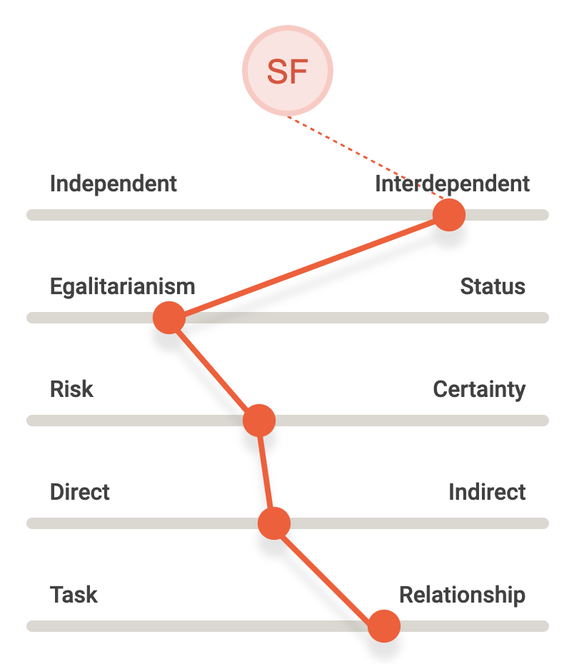

I took a quiz offered by [aperian.com](https://aperian.com/) to build my, what they call, GlobeSmart profile.  
The result is interesting to share and compare. Here is mine.

> You enjoy working as part of a group. You're flexible about roles and titles, and willing to challenge your superiors if you feel it is necessary. You tend to be decisive and like to demonstrate quick results. You generally say what you mean, but you can also be subtle when needed. You value relationships and will not sacrifice them for a deadline.

<!-- truncate -->

## You are Interdependent.

Those who are Interdependent tend to:

- Place great importance on group harmony and cooperation
- Derive identity from group affiliation
- Feel a sense of duty, obligation, and loyalty to ascribed groups

In contract, those who are Independent tend to:

- Place great importance on individual identity
- Derive identity from personal choices and achievements
- Prefer taking action on one's own

## You are moderately Egalitarian.

Those who are Egalitarian tend to:

- Be comfortable challenging the views of superiors
- Be flexible about roles and titles
- Assume power and authority should be shared broadly among a group

In contrast, those who are Status oriented tend to:

- Prefer not to challenge those above them
- Adapt behavior depending on relative status
- Assume power and authority should be reserved for a few members of a group

## You are moderately Risk oriented.

Those who are Risk oriented tend to:

- Prefer rapid decision-making and quick results
- Place great importance on flexibility and initiative
- Value speed over thoroughness

In contrast, those who are Certainty oriented tend to:

- Spend significant time on background research
- Establish proper procedures before starting a project
- Value thoroughness over speed

## You are in the middle between Direct and Indirect.

Those who are between Direct and Indirect tend to:

- Provide some context before coming to the point
- Be willing to disagree with others in a public forum, but will do so cautiously
- Generally say what they mean, but can also be subtle when needed

## You are moderately Relationship oriented.

Those who are Relationship oriented tend to:

- View time building relationships as key to achieving good results
- Prioritize maintaining relationships over accomplishing tasks on time
- Focus on who people know as much as what they themselves can achieve

In contrast, those who are Task oriented tend to:

- Place high value on reaching goals and objectives on schedule
- Prioritize accomplishing tasks over maintaining relationships
- Focus on what people achieve more than whom they know

## Any Thoughts?

What do you think? Do you think there is a perfect mix everyone should aim to, or a team should have mixed work profiles?
Here is [my sharable profile](https://app.aperian.com/share/profile/5ede44a0-ba48-49ae-bee5-47e0923e218a) to know more. 👋 

📄 [download](./saverio-ferrara-globesmart-profile.pdf)
