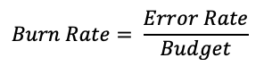
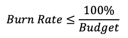
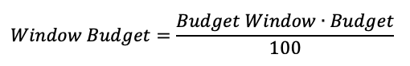
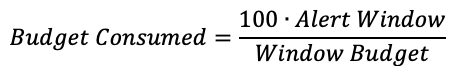
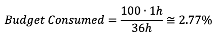
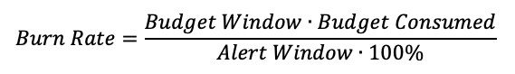
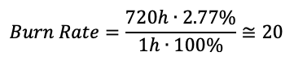
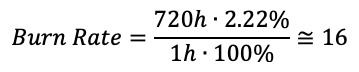
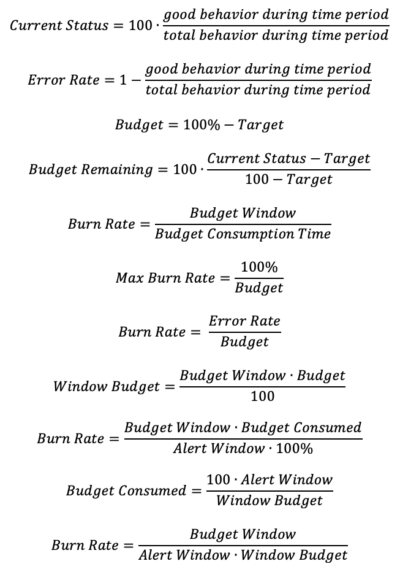

As a software engineer, if you're reading this, for sure you already know that the error budget is defined when we select a _Service Level Indicator_ (SLI) and for it set a target _Service Level Objective_ (SLO) over a specific time period. If you don't, head to the "references" section below which suggests introductory resources.

How fast can we consume the error budget? This question was not easy to answer for me. That's why I'd like to share my notes.

<!-- truncate -->

Let’s focus on a specific example so that we’ll be able to quantify the error budget. We’ll consider an availability SLI that, as you surely know, is the proportion of the good events over the total number of events. In addition, we’ll consider:

- **SLO target**: 95%
- **Budget window**: 720h (i.e., 30 days)

In case you’re not familiar with those concepts, at the end of this article there is the “terminology” section that can help. 

The error budget is the amount of not “good events” derived from an SLO’s target percentage (100% - target percentage). In our case, the error budget is 100% - 95%. Hence:

- **Error budget**: 5%

Google introduced the concept of **burn rate** which is a number which represents how fast, relative to the SLO, the service consumes the error budget. It is defined as:

By definition, a burn rate of 1 means that the service is consuming the error budget at a rate that leaves you with exactly 0 budget at the end of the budget window.  
A burn rate of 2 means that the service is consuming the error budget twice as fast as a burn rate of 1.

The burn rate can’t be an infinite number. Considering we’re experiencing a complete service outage, then our error rate is 100%. So, the _maximum burn rate_ is:

In our example the maximum burn rate is 100% divided by 5%, hence:

- **Max Burn Rate**: 20

So, how fast can we burn the error budget? The maximum burn rate tells us that we can consume the error budget up to 20 times faster than normal. This doesn’t answer our question!

## How big is my error budget?

Let’s reason in hours and see if we can make it clearer. The key concept here is that we should consider a “complete outage” of the service.

An error budget of 5% over a budget window of 720h tells us that we are allowed to have a complete outage of 36h without violating the SLO target. This is the **Window Budget**:

Returning to the initial question… how fast can we burn the error budget? The answer is 36 hours.

## How much error budget can I consume in one hour?

This question is more interesting and allows us to set alerts. Instead of considering the entire budget window of 720 hours, let’s focus on a restricted alert window of 1 hour. In case of a complete outage, the maximum amount of **budget consumed** is:

In our case:

Careful here! The _maximum budget consumed_ is 2.77% of the entire error budget. So, in one hour we can consume 2.77% of 5%. Always considering a complete outage.

## How to set a burn rate alert for a complete outage?

Having an alert on the burn rate, means we want to be alerted if our budget is consuming fast over a restricted time period (i.e., the alert window). Monitoring tools allow us to set such kinds of alerts and we should only define how long should be the alert window and what is the burn rate threshold. Like before we’ll suppose 1-hour alert window and the burn is calculated as:

Let’s do the math:

This is exactly the value we got before for the maximum burn rate. In fact, we’re still considering a complete outage.

## How to set a burn rate alert for a major outage?

Alerting on a complete outage is very extreme and, in some cases, may lead to poor alert recall. A more reasonable approach is to be alerted when 80% of the calls are failing. Let’s do this.

If in case of a complete outage, we can burn 2.77% of the budget, then we should decrease it by 20% if 80% of the calls are failing. The resulting budget consumed in 1 hour is then ~2.22%. Let’s apply the burn rate formula again, and we’ll have:

Answer: having an alert with a burn rate of 16 will warn us in case we’ll experience a drop of 80% of the good events during the 1-hour period.

## Terminology

**SLI** (%): Service Level Indicator. A quantifiable measure of service reliability that tells you if things are working.

**SLO** (%): Service Level Objective. A reliability target for an SLI that tells you if the users are happy or sad.

**SLA** (%): Service Level Agreement. A contract that the service provider promises users on service reliability. Agreed reliability targets should be more relaxed than the internal SLOs to give enough room for unexpected outages.

**Target** (%): SLO Target. It is the availability target (%) defined by the SLO.

**Budget** (%): Error Budget. Either the number of requests out of the total requests or the amount of time for a given period, a system can afford to be unreliable before users become unhappy.

**Burn Rate** (number): It is an indicator that defines how fast, relative to the SLO, the service consumes the error budget.

**Budget Window** (h): The length of the error budget window. We recommend 30 days (720 hours). It usually is 7, 30, or 90 days.

**Alert Window** (h): It is a time window (in hours) in which we’d calculate the burn rate and notify the team if the budget is burning too fast. For example 1 hour.

**Budget Remaining** (%): Error Budget Remaining. The remaining error budget within the Budget Window

**Budget Consumed** (%): It is the percentage of Error Budget consumed within a time period. For alerts, it refers to the Alert Window.

**Current Status** (%): It is the SLI value over the budget window.

**Budget Consumption Time** (h): Time (hours) until the error budget is entirely consumed within the time window.

**Window Budget** (h): This is the total amount of time we can spend with a complete outage that will consume the entire Budget.

## References

•	[Google SRE: implementing SLOs](https://sre.google/workbook/implementing-slos/)
•	[Google SRE: alerting on SLOs](https://sre.google/workbook/alerting-on-slos/)
•	[Error budget policy at Expedia Group](https://medium.com/expedia-group-tech/error-budget-policy-adoption-at-expedia-group-7d80d41c4a8b)
•	[Error budget policies in practices](https://medium.com/expedia-group-tech/error-budget-policies-in-practice-4c98f56a28c1)

Other resources available:

- [The story is available on Medium](https://medium.com/@fsferrara/error-budget-burn-rate-alerts-for-major-outages-3e999f8a200d?source=friends_link&sk=117fc8435eeb3deed664c177efcf697e).
- [💾 Error budget formulas cheat-sheet](/downloads/error-budget-formulas.pdf).

## Appendix: Error Budget Formulas

Thank you!
