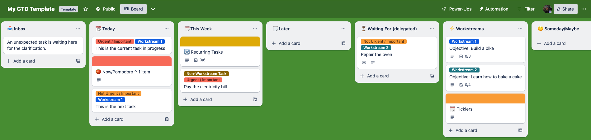

Almost everyone knows GTD. It is the acronym of "Getting Things Done" which is a productivity framework introduced by David Allen in his book "Getting Things Done (2002) - The Art of Stress-Free Productivity".  
The key reason to have a such framework is that our mind is great at creating stuff, but it's terrible at tracking it. And yet there's a good chance you're tracking tons of stuff in your head right now. Stuff that drains your energy and clogs your creativity.

I became a GTD user during a period in which I was so full of things to do that I couldn't work well. Just keeping the task list in mind completely occupied my brain and I could no longer concentrate on the task in progress.  
I GTD love it since it keeps track of my tasks and allows me to focus on each one of them individually. Also, it allows me to work on several workstreams (or projects) during the same period (e.g. a quarter).

<!-- truncate -->

I'd like to recap in this post how I applied the framework. My main goals were to keep the entire procedure lightweight, portable, and almost paperless.

## The tools

Let's get straight to what everyone wants to know: the tool/software I adopted.

The first tool is a digital calendar. I don't suggest a specific calendar over another since they are all similar and I bet you already have one. In my calendar, I keep track of ticklers, recurring tasks, and, of course, meetings.

Another tool is... a notebook! Even if I can easily replace it with a digital solution, I can't stop using paper and pen.

The last tool is a Trello Board.

### GTD Trello Board

The reasons I chose Trello are several, I can list some from my top of mind:

- a board allows you to have a quick look at all your lists,
- it allows you to quickly move cards (i.e. stuff) from one list to another,
- Trello cards may have attachments like images, checklists, documents, etc.,

I shared [my Trello Board Template for GTD](https://trello.com/b/JD7ituj7/my-gtd-template). It is ready to use and contains useful instructions in the right place to reduce friction during its usage.

In the next sections, each list of this board is described.

#### Horizons of Focus

I like to start top-down and define what is my purpose first. Keeping it in mind allows me to define priorities for each task and discard what is not useful to pursue the purpose.

Allen suggests working on the big picture thinking with 5 increasingly top-down horizons:

- Horizon 5: Purpose and principles – The purpose, mission, and values at the heart of your existence;
- Horizon 4: Vision – A broad overview of what success looks like for you on a 3 – 5 years timeline;
- Horizon 3: Goals – The larger outcomes you'd like to make manifest in the next 1 – 2 years;
- Horizon 2: Areas of Focus and Accountabilities – The roles and areas of life you are committed to focussing on in the next 12 months;
- Horizon 1: Current projects – The list of any outcome you are committed to realizing in < 12 months. Personally, for this horizon, I prefer defining activities that can be done in a quarter (i.e. less than 3 months).

In my GTD implementation, I defined a Trello list "Horizons of Focus" containing a card for each horizon from H5 (i.e. Horizon 5) to H2 (i.e. Horizon 2). In those cards, there is just a textual description of the related horizon.

The Horizon 1 is an exception since it is simplistic to describe it in a single card, especially if you are keeping track of multiple workstreams. For H1 (i.e. Horizon 1) I defined a dedicated list named "Workstreams".

The "Ground" for those horizons are the tasks/actions at the core of getting things done. They are all the cards contained in the lists: "Later", "This Week", "Today", and "Completed".

#### Workstreams

The Workstreams (that are Projects and Outcomes) are listed here. I have one card for each of them containing a description and split into several milestones. If needed, in the workstream card I can define the list of tasks using a "Checklist". Trello allows me to convert a checklist item into a new card so that I can pull tasks from the workstream when I need them.

I suggest reviewing the "Workstream" list monthly. It is good to keep in mind what are the current activities and what is their status.

A note about acquiring new skills. Learning is something everyone should continue doing with constancy. In some cases, it is essential to continue being employable. I use a dedicated workstream to keep track of this activity and be sure to dedicate to it a portion of my time.

#### Inbox

The "Inbox" list is where I stockpile everything. I'm careful not to leave stuff on this list for too long. I usually review this list once or twice a day following the Step 1-2-3 procedure described below.

**Step 1: Stockpile**

Stockpiling is "Step 1" to enter in my GTD system and means capturing all your outstanding stuff. It's a vital step because anything that doesn't get in your GTD system will stay on your mind. And anything that stays on your mind eats energy and kills creativity.

Trello allows me to define an inbox email address I can use to forward stuff (usually emails). I can also stockpile from my smartphone since Trello is accessible from it.
I may have other stuff in my physical notebook. At the end of the day, I store all the pending stuff in the "Inbox" so I don't leave it off the system.

Once stockpiling is done, the "Inbox" list is not executable yet. Each item in the list needs to be clarified in "Step 2".  

**Step 2: Clarify**

Clarifying an item means answering questions about it. These questions are:

- What is it?
- What's the desired outcome?
- What's the priority?
- Is it important for my workstreams?
- Can I delegate it?
- How much time is required to do it?
- Is it a time-sensitive activity? Does it have an ETA?

Usually, I clarify my card by adding details to the card. In particular, I use labels to specify the priority.  
Once the clarification of a card is done, a card should leave the "Inbox" list and go to another one. This is the "organization" phase (i.e. Step 3).

**Step 3: Organize**

Organizing is the process of addressing the cards on the "Inbox" list. I use an algorithm like this one for each card:

- If I can do the activity described in the card in less than 2 minutes, then I proceed and do it. Once completed, the card goes into the "Completed" list.
- If the card can be safely delegated, then I'll delegate it and wait. The card goes into the "Waiting For (delegated)" list. I check this latter list daily to ask if there are updates.
- If the card scope is too big, then it is non-actionable ‘stuff'. It is like a "project", so something that needs to be refined. In this case, I can either plan a time slot to refine the card or (if it is not urgent) just store the card content in a proper place for future reference (e.g. amongst my computer documents).
- If it is something not urgent, then I'll defer the activity and the card goes into the "Later" list.
- If it is something urgent, then I'll move the card to the "Today" or "This Week" list. It depends on how much urgent is it.
- Trashing what's left. The entire stockpile-clarify-organize process allows us to detect activities that are not important.

#### Later

In the "Later" list there are the cards I have to execute. Each week, I review this list and define the week's scope by moving the cards I want to execute during that week to the "This Week" list.
If a card is in the "Later" list for a long time, you may want to move it to the "Someday/Maybe" list.

#### This Week

In the "This Week" list there are the cards part of the current week's scope. Each morning, when I plan the activity for the day, I move some cards from the "This Week" list to the "Today" list.

#### Today

The "Today" list contains the cards that are in the scope of the day.
Here is where my notebook comes into play. I don't particularly appreciate stating at this digital list all day long. For this reason, I copy the card titles on paper (like a task list) and then execute them.
At the end of the day, the done cards will be moved into the "Completed" list.

If you want to go completely paperless, then this list can be used instead of the notebook.

#### Someday/Maybe

The "Someday/Maybe" list contains outcomes or actions you may like to take one day, under different circumstances.
Each quarter, or when I start a new workstream, I review the entire GTD board. On this occasion, I may re-organize the cards by moving them around. During this review, you can trash the cards that are in the "Someday/Maybe" list that are no more relevant.

## Are you using GTD?

In conclusion, implementing the GTD framework has transformed my productivity and focus. With a digital calendar, trusty notebook, and Trello board, I've achieved a lightweight, organized, and almost paperless workflow.

The Horizons of Focus provided clarity on my purpose, goals, and priorities, while Trello streamlined task management from "Inbox" to "Completed."

If you're willing to use GTD, as you embrace it, I suggest you to customize it to fit your needs. Embrace stress-free productivity and enjoy a fulfilling life with purpose and efficiency.

Happy organizing and best wishes!
