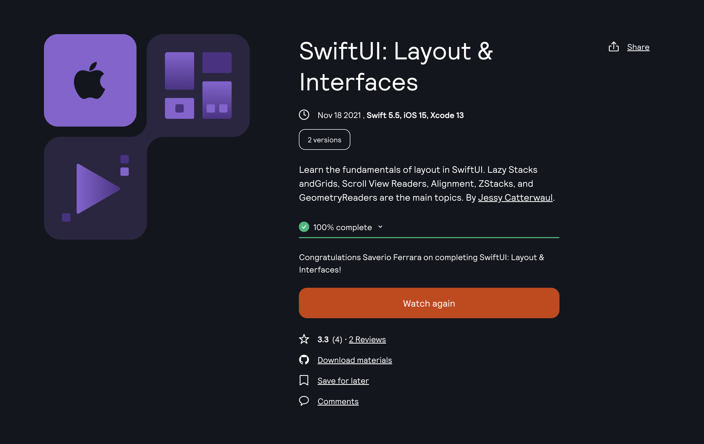

Learning Platform: [Kodeko](https://www.kodeco.com/)
Course: [SwiftUI: Layout & Interfaces](https://www.kodeco.com/28684964-swiftui-layout-interfaces)

<!-- truncate -->

## Learning path

This is part of the **iOS User Interfaces with SwiftUI** learning path. [View path](https://www.kodeco.com/ios/paths/iosuserinterface).

## Who is this for?

This course comes after SwiftUI: Fundamentals in our [iOS User Interfaces with SwiftUI learning path](https://www.kodeco.com/ios/paths/iosuserinterface). You’re ready for this course if you’re working through that learning path in order, or you’re someone who has a bit of iOS and Swift experience: enough to know the basics of putting views onscreen in a SwiftUI-based app.

The first part of the course is all-new for iOS 14. You’ll be working a lot with scroll views, and lazy views: both stacks, and grids.

In the second part, you’ll start working with Alignments, which are key to making the most out of Stacks. You’ll learn how to use built-in alignment guides, and create your own custom ones.

Moving on from Alignment, the course will conclude with the ZStack and GeometryReader structures.

Throughout the course, you’ll practice everything you learn with hands-on challenges, recreating the kind of layouts you’ll find in user interfaces from popular iOS apps.

This course isn’t suited for advanced developers. If that’s you, check out our [advanced](https://www.kodeco.com/library?domain_ids%5B%5D=1&content_types%5B%5D=collection&difficulties%5B%5D=advanced) video courses for more ways to level-up your developer skills!

## Covered concepts

- Stacks
- Grids
- Headers and Footers
- Stack Alignment
- alignmentGuide Modifier
- AlignmentID Protocol
- GeometryReader + GeometryProxy

